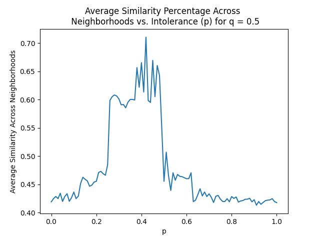

# SchellingsModelSimulation
 A simulation of the Schelling's Segregation Model

# Grid.py

Outlines the class `Grid` which is a representation of the simulation's grid. 

## attributes:

- `size`: the size of the grid, where the grid is of dimensions `size` x `size`.
- `p`: the fraction of neighbors each agent would like to be of the same type.
- `q`: the fraction of type 1 agents out of all agents.
- `grid`: an array representation of the grid, where 0 indicates an empty cell and 1 and 2 indicate agents of types 1 and 2 respectively.

## methods:

### init

Class constructor.

**args:**

- `p`: the fraction of neighbors each agent would like to be of the same type- should be in range [0, 1].
- `q`: the fraction of type 1 agents out of all agents- should also be in range [0, 1].
- `size`: the size of the grid, where the grid is of dimensions `size` x `size`. Default value: `50`.
- `empty`: the fraction of empty cells out of all cells- should be in range [0, 1]. Default value: `0.1`.

### get_sim_pct

Calculates similarity percentage in neighborhood.

**args:**

- `x`: the row of the neighborhood center.
- `y`: the column of the neighborhood center.
- `t`: type to check against- if `0`, then check against type of agent in the center. Default value: `0`.

### get_avg_sim

Calculates the average similarity percentage across neighborhoods in the entire grid. Return `True` if agent at location is unsatisfied, and `False` if agent is satisfied or no agent at location.

### is_unsatisfied

Checks whether agent is unsatisfied.

**args:**

- `x`: the row of agent.
- `y`: the column of agent.

### get_dist_cells

Gets coordinates of all cells in grid at the given Chebyshev distance.

**args:**

- `x`: the row of origin cell.
- `y`: the column of origin cell.
- `distance`: the distance 

### find_nearest_empty

Finds the nearest empty cell in which the agent would be satisfied.

**args:**

- `x`: the row of agent cell.
- `y`: the column of agent cell.

### step

Takes a step in the simulation: chooses a random unsatisfied agent, places it in the nearest empty spot in which it'll be satisfied. Return `True` if it is able to complete the step, and `False` otherwise.

### simulate

Runs the simulation.

**args:**

- `max_steps`: maximum number of steps to take before termination. If `None`, run until `self.step()` returns `False`.

## simulation:

We ran the simulation for `q = 0.5` and default values for `size` and `empty` for 100 equally spaced values of `p` in the range [0, 1].

